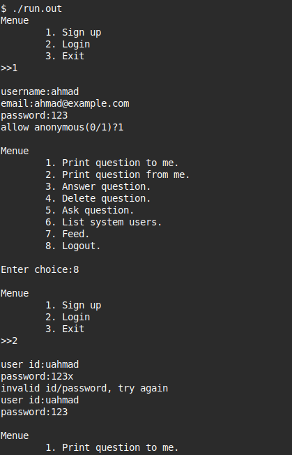
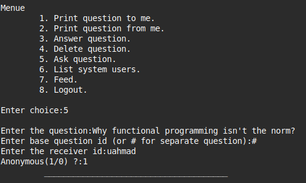
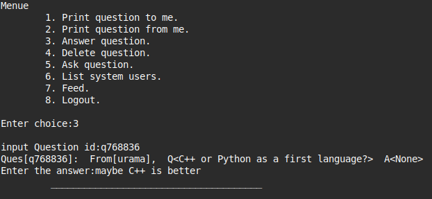

# Askfm

Q&A console-based C++ application with file-based data storage.

## The Big Picture

- every time the user runs it, he sees the previous state (users/questions/answers).
- multiple users can use it in same time (**parallel**).
  - you send question. i see it
  - i answer the question or remove it, you see this update
- login/sign up/sign out
  - the system allow a user to sign up (name, email, password, username, password).
  - a user chooses whether to allow anonymous questions or not.
- user operations
  - print questions from you, to you, and the feed questions.
  - ask/answer questions, and system-supported threads
  - delete a question (which can be a thread)

## Design

- every user has a system generated id
  - same for every question
  - we can view these ids on the site (not realistic)
- a thread question
  - if a question is answered. others can ask questions in the original question thread
  - e.g. original question is parent for all of them
  - if this parent question is removed, the whole thread is removed
- correctness
  - you can’t do something wrong!
  - e.g. you can’t remove a question ask to someone else!
    - you only see/edit the details of your question

## Screenshots

### creating a user



### asking a question



### answering a question



## Running

```bash
git clone git@github.com:madany01/askfm.git
cd askfm

g++ --std=c++20 -o run.out src/main.cpp

./run.out
```
